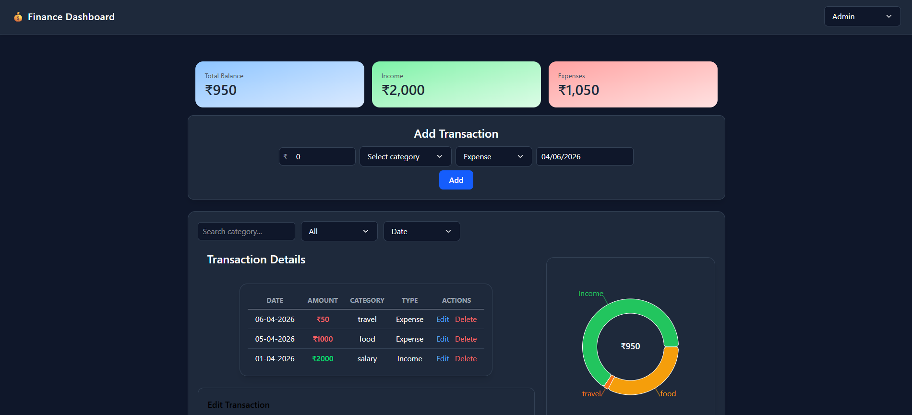
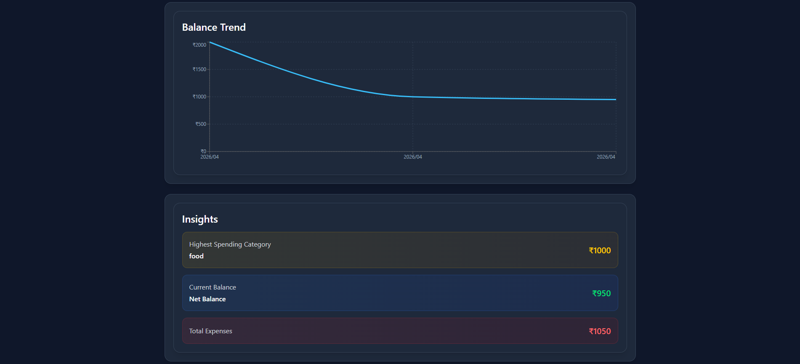

# 💰 Finance Dashboard

A modern and interactive **Finance Dashboard** built using React that helps users track income, expenses, and overall balance with visual insights.

---

## 🚀 Features

* 📊 Track **Income & Expenses**
* 💼 View **Total Balance**
* 🧾 Add, Edit, and Delete Transactions
* 🔍 Filter transactions by category, type, and date
* 📈 Visualize data using:

  * Pie Chart (category breakdown)
  * Balance Trend Graph
* 💡 Insights section:

  * Highest spending category
  * Total expenses
  * Net balance
* 🌙 Clean **Dark Theme UI**

---

## 🛠️ Tech Stack

* **Frontend:** React + TypeScript
* **Styling:** Tailwind CSS
* **Charts:** Recharts
* **Icons:** React Icons
* **State Management:** React Hooks / Zustand 

---

## 📸 Demo

### Dashboard Overview



### Charts & Insights



---

## 📂 Folder Structure

```
src/
│── components/
│   ├── Navbar.tsx
│   ├── TransactionTable.tsx
│   ├── PieCharts.tsx
│   ├── BalanceTrend.tsx
│
│── store/
│   ├── useTransactionStore.ts
│
│── types/
│   ├── index.ts
│
│── App.tsx
│── main.tsx
```

---

## ⚙️ Installation & Setup

1. Clone the repository

```bash
git clone https://github.com/your-username/finance-dashboard.git
```

2. Navigate to the project

```bash
cd finance-dashboard
```

3. Install dependencies

```bash
npm install
```

4. Run the app

```bash
npm run dev
```

---

## ✨ Future Improvements

* 📅 Monthly analytics view
* 📤 Export transactions (CSV)
* ☁️ Cloud storage / backend integration
* 📱 Fully responsive mobile design
* 🔔 Smart spending insights

---
